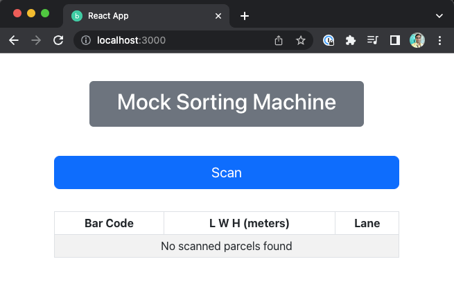
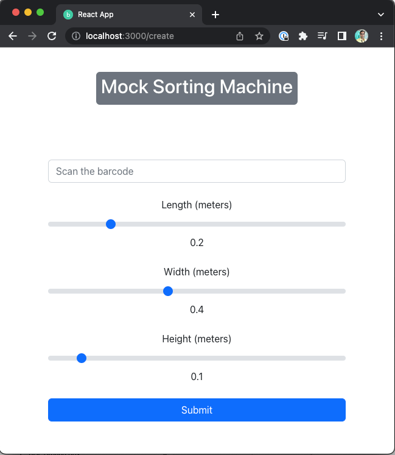

### Steps to setup

* Verify node is installed (minimum version):
  * (base) mocksortingmacine % node -v
  * v14.19.3
* Verify npm is installed
  * (base) mocksortingmacine % npm -v 
  * 6.14.17
* Navigate to root of the project from terminal
* run `npm install`
* Configure terminal server ( TCP Server) in file `src/server/tcpClient.js`
* Verify terminal server is running and responding 
  * Mac M1 terminal scripts
    * Connect: (base) mayankarora % `nc 192.168.1.128 48898`
    * Send: <STX>{"machine":"brunna_top","barcodes":["BUD1044248811"],"dimensions":{"width":0.390,"height":0.400,"length":0.576},"sickVolumeState":["0000","00000000","00000001"]}<ETX>
    * Expected response: <STX>{"machine":"brunna_top","barcode":"BUD1044248811","lane":"null"}<ETX>
* In case terminal server is not running there is a mock terminal server with code.
  * It can be started as `node src/server/tcpServer.js`
  * Update host and port for mock terminal server in file `src/server/tcpClient.js`
* run `node src/reactServer/reactServer.js` to start server.
  * Server port is mentioned in the same file in case you update it, the following file should needs update: ``
* run `npm run start` to start react ui.

* The following page should open on browser (http://localhost:3000/):
  * 
  * 
